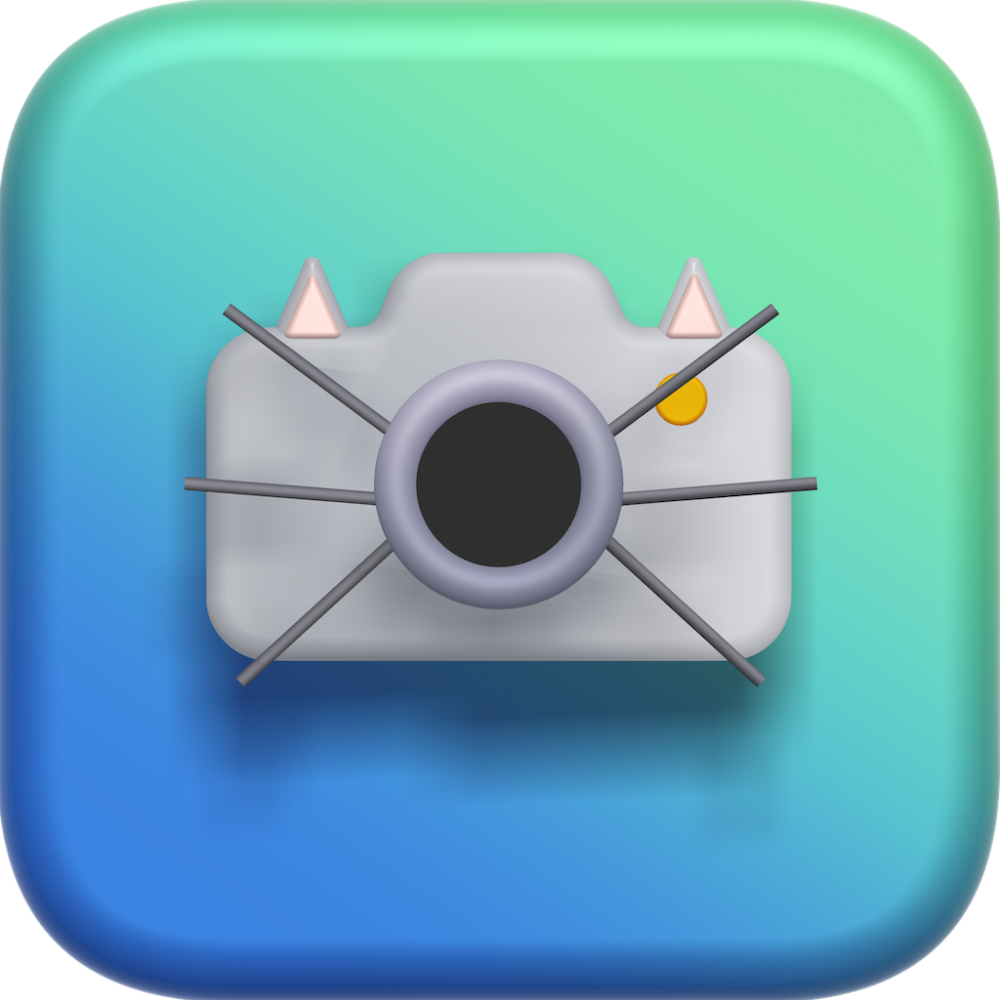

<!-- Improved compatibility of back to top link: See: https://github.com/othneildrew/Best-README-Template/pull/73 -->

<!--
*** Thanks for checking out the Best-README-Template. If you have a suggestion
*** that would make this better, please fork the repo and create a pull request
*** or simply open an issue with the tag "enhancement".
*** Don't forget to give the project a star!
*** Thanks again! Now go create something AMAZING! :D
-->

<!-- PROJECT SHIELDS -->
<!--
*** I'm using markdown "reference style" links for readability.
*** Reference links are enclosed in brackets [ ] instead of parentheses ( ).
*** See the bottom of this document for the declaration of the reference variables
*** for contributors-url, forks-url, etc. This is an optional, concise syntax you may use.
*** https://www.markdownguide.org/basic-syntax/#reference-style-links
-->
[![LinkedIn][linkedin-shield]][linkedin-url]
[![MIT License][license-shield]][license-url]

<!-- PROJECT LOGO -->
 

  

  <h3 align="center">WildCatch<h3>

  

    Swift Student Challenge 2023
     
     
  

<!-- TABLE OF CONTENTS -->

  
Table of Contents

  <ol>
    <li>
      <a href="#about-the-project">About The Project</a>
      <ul>
        <li><a href="#built-with">Built With</a></li>
      </ul>
    </li>
    <li><a href="#license">License</a></li>
    <li><a href="#contact">Contact</a></li>
    <li><a href="#acknowledgments">Acknowledgments</a></li>
  </ol>

<!-- ABOUT THE PROJECT -->
# About The Project

[![Product Name Screen Shot][product-screenshot]](https://github.com/JoaoFranco03/EcoRede)

This Project consists of an application that helps people learn more about wildlife and endangered species, either through the learn page of the app or by snapping photos of animals to get information about them.

This app is written in Swift. It utilizes various features and APIs to provide users with an educational experience about different species of animals and their conservation status.

The key features of the app include:

1. Species Identification: Users can take photos of animals they encounter in the wild, and the app uses image recognition technology to identify the species. The app then retrieves relevant information about the identified animal, including its scientific name, habitat, behavior, and conservation status.
2. Species Database: The app maintains a comprehensive database of various wildlife species, including both common and endangered animals. Users can browse through the database to access detailed information, such as species descriptions, threats they face, and conservation efforts being made to protect them.
3. Educational Content: The app provides a dedicated "Learn" section that offers interactive content to educate users about different wildlife species, their ecosystems, and the importance of conservation. This section covers topics such as biodiversity, habitat loss and climate change.

By combining the power of image recognition and educational content this app aims to raise awareness about wildlife and endangered species, fostering a sense of responsibility and encouraging users to take action to protect our natural world.

(<a href="#readme-top">back to top</a>)

## Build and Runtime Requirements

* Xcode 14.0 or later
* iOS 16.0 or later
* macOS 12.5 or later

(<a href="#readme-top">back to top</a>)

## Built With

* [![Swift][Swift.org]][Swift-url]
* [![Xcode][xcode-shield]][xcode-url]

(<a href="#readme-top">back to top</a>)

<!-- LICENSE -->
## License

Distributed under the GPL-3.0 License. See `LICENSE.txt` for more information.

(<a href="#readme-top">back to top</a>)

<!-- CONTACT -->
## Contact

João Franco - https://www.linkedin.com/in/joão-franco-452161195/

Project Link: [https://github.com/JoaoFranco03/WildCatch/](https://github.com/JoaoFranco03/WildCatch/)

(<a href="#readme-top">back to top</a>)

<!-- ACKNOWLEDGMENTS -->
## Acknowledgments

* [Choose an Open Source License](https://choosealicense.com)
* [SF Symbols](https://developer.apple.com/sf-symbols/)

(<a href="#readme-top">back to top</a>)

<!-- MARKDOWN LINKS & IMAGES -->
<!-- https://www.markdownguide.org/basic-syntax/#reference-style-links -->
[contributors-shield]: https://img.shields.io/github/contributors/othneildrew/Best-README-Template.svg?style=for-the-badge
[contributors-url]: https://github.com/othneildrew/Best-README-Template/graphs/contributors
[forks-shield]: https://img.shields.io/github/forks/othneildrew/Best-README-Template.svg?style=for-the-badge
[forks-url]: https://github.com/othneildrew/Best-README-Template/network/members
[stars-shield]: https://img.shields.io/github/stars/othneildrew/Best-README-Template.svg?style=for-the-badge
[stars-url]: https://github.com/othneildrew/Best-README-Template/stargazers
[issues-shield]: https://img.shields.io/github/issues/othneildrew/Best-README-Template.svg?style=for-the-badge
[issues-url]: https://github.com/othneildrew/Best-README-Template/issues
[xcode-shield]: https://img.shields.io/badge/Xcode-007ACC?style=for-the-badge&logo=Xcode&logoColor=white
[xcode-url]: https://developer.apple.com/xcode/
[license-shield]: https://img.shields.io/github/license/JoaoFranco03/WildCatch.svg?style=for-the-badge
[license-url]: https://github.com/JoaoFranco03/WildCatch/blob/main/LICENSE
[linkedin-shield]: https://img.shields.io/badge/-LinkedIn-black.svg?style=for-the-badge&logo=linkedin&colorB=555
[linkedin-url]: https://www.linkedin.com/in/joão-franco-452161195/
[product-screenshot]: assets/Mockup.png
[Swift.org]: https://img.shields.io/badge/Swift-FA7343?style=for-the-badge&logo=swift&logoColor=white
[Swift-url]: https://www.swift.org

